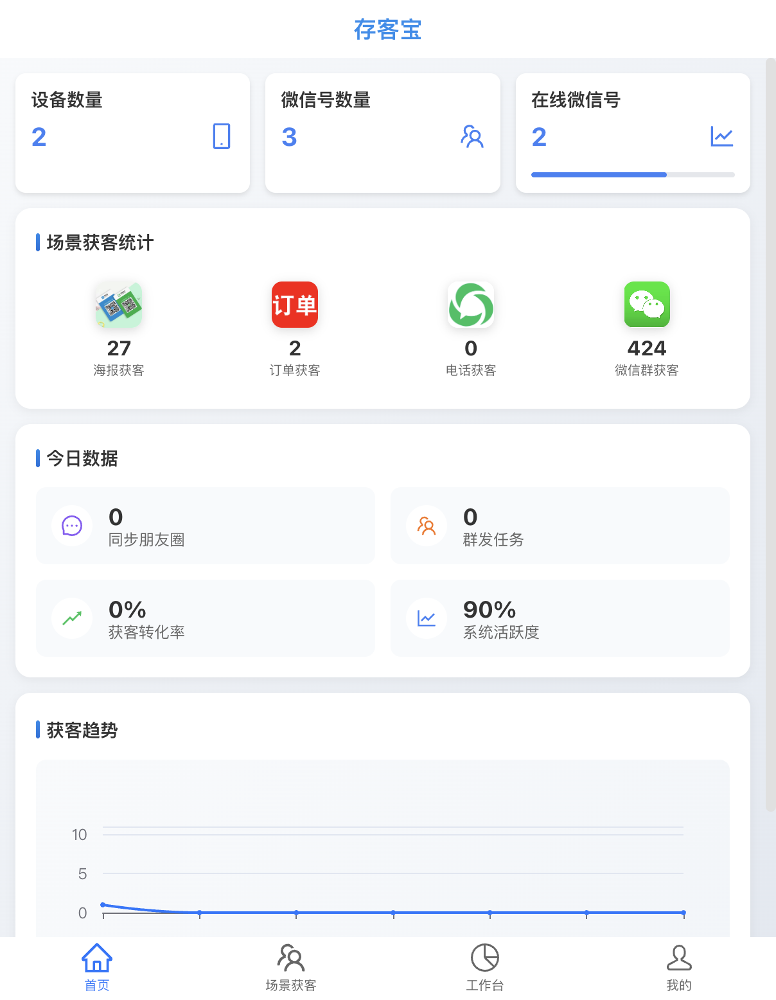
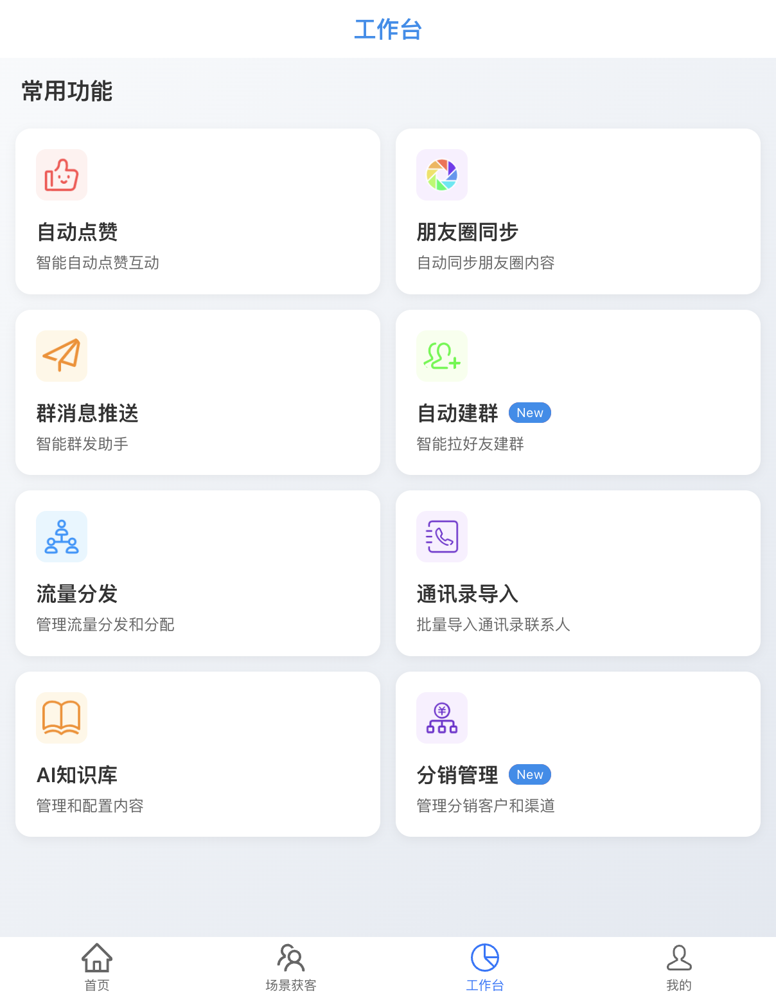
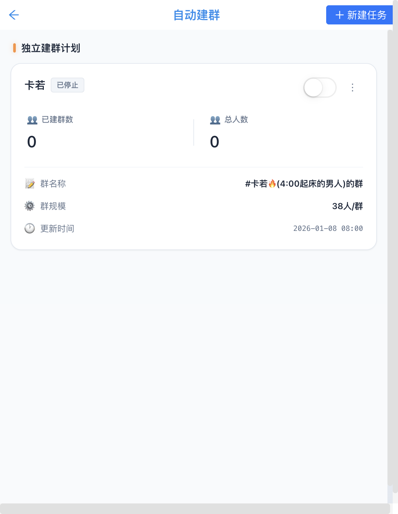
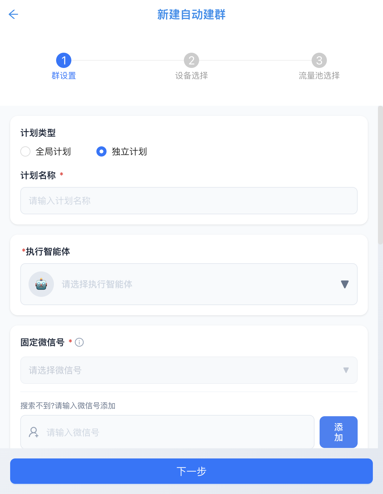
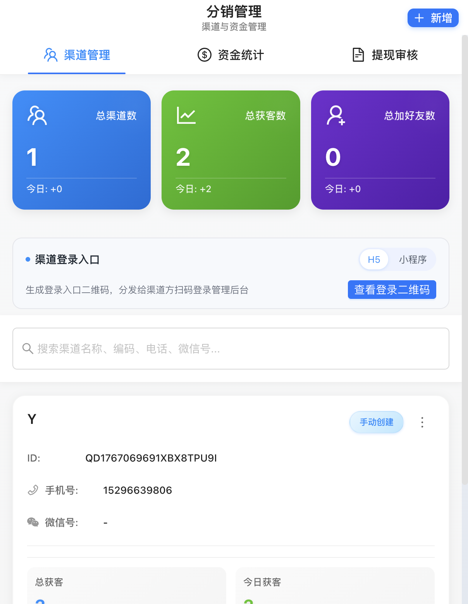

# 📱 存客宝使用手册

**版本**：v3.0.0
**更新日期**：2026年1月
**适用平台**：Web / H5 / 移动端

---

## 📋 目录

1. [系统概述](#一系统概述)
2. [快速入门](#二快速入门)
3. [首页功能](#三首页功能)
4. [设备管理](#四设备管理)
5. [微信号管理](#五微信号管理)
6. [内容库](#六内容库)
7. [工作台功能](#七工作台功能)
8. [流量池管理](#八流量池管理)
9. [分销管理](#九分销管理)
10. [数据中心](#十数据中心)
11. [常见问题](#十一常见问题)

---

## 一、系统概述

### 1.1 产品简介

**存客宝**是一套私域运营自动化系统，帮助企业实现：

- 🎯 **高效获客**：多场景自动获取客户
- 🤖 **自动运营**：朋友圈同步、消息群发、自动建群
- 📊 **数据分析**：客户价值评估、运营数据统计
- 💰 **分销裂变**：渠道管理、佣金结算

### 1.2 系统访问

| 系统 | 地址 | 说明 |
|------|------|------|
| **存客宝** | https://kr-op.quwanzhi.com/ | 管理后台 |
| **触客宝** | https://kr-kf.quwanzhi.com/ | 客服聊天 |
| **AI数智员工** | https://kr-phone.quwanzhi.com/ | AI助手 |

### 1.3 测试账号

| 账号 | 密码 |
|------|------|
| karuo | key123456 |
| 15880802661 | kr123456 |

---

## 二、快速入门

### 2.1 登录系统

1. 打开存客宝网址：https://kr-op.quwanzhi.com/
2. 输入账号和密码
3. 点击「登录」按钮

### 2.2 首次使用流程

```
1. 添加设备 → 2. 登录微信 → 3. 同步好友 → 4. 创建内容 → 5. 开始运营
```

**步骤详解**：

| 步骤 | 操作 | 说明 |
|------|------|------|
| 1 | 添加设备 | 扫码绑定手机设备 |
| 2 | 登录微信 | 在设备上登录微信号 |
| 3 | 同步好友 | 系统自动同步好友列表 |
| 4 | 创建内容 | 在内容库创建营销素材 |
| 5 | 开始运营 | 使用工作台功能开始运营 |

---

## 三、首页功能

### 3.1 数据概览

首页展示核心运营数据：



| 数据项 | 说明 |
|--------|------|
| **设备数量** | 已绑定的手机设备数 |
| **微信号数量** | 已登录的微信号数 |
| **在线微信号** | 当前在线的微信号数 |
| **好友总数** | 所有微信号的好友总数 |

### 3.2 场景获客统计

| 场景 | 说明 |
|------|------|
| 海报获客 | 通过海报二维码获取的客户 |
| 订单获客 | 通过订单数据转化的客户 |
| 电话获客 | 通过电话号码添加的客户 |
| 微信群获客 | 从群聊中获取的客户 |

### 3.3 今日数据

| 数据项 | 说明 |
|--------|------|
| 同步朋友圈数 | 今日发布的朋友圈数量 |
| 群发任务数 | 今日执行的群发任务数 |
| 获客转化率 | 获客到添加好友的转化率 |
| 系统活跃度 | 系统运行状态指标 |

---

## 四、设备管理

### 4.1 功能入口

**路径**：我的 → 设备管理

### 4.2 添加设备

1. 点击「+ 添加设备」按钮
2. 使用手机扫描二维码
3. 在手机上确认绑定
4. 等待设备上线

### 4.3 设备状态

| 状态 | 说明 |
|------|------|
| 🟢 在线 | 设备正常运行 |
| 🔴 离线 | 设备已断开连接 |
| 🟡 异常 | 设备运行异常 |

### 4.4 设备操作

| 操作 | 说明 |
|------|------|
| 查看详情 | 查看设备详细信息 |
| 重启设备 | 远程重启设备 |
| 解绑设备 | 解除设备绑定 |

---

## 五、微信号管理

### 5.1 功能入口

**路径**：我的 → 微信号管理

### 5.2 微信号列表

展示所有已登录的微信号：

| 信息 | 说明 |
|------|------|
| 头像/昵称 | 微信号基本信息 |
| 好友数 | 该微信号的好友数量 |
| 健康分 | 账号安全评分 (0-100) |
| 状态 | 在线/离线 |

### 5.3 健康分说明

健康分是微信账号的安全评分，影响每日添加好友的上限。

**计算公式**：
```
每日最大加人次数 = 健康分 × 0.2
```

**健康分组成**：

| 项目 | 分数 | 说明 |
|------|------|------|
| 基础分 | 60分 | 默认基础分 |
| 已修改微信号 | +10分 | 修改过微信号 |
| 好友 0-50 | +3分 | 好友数量少 |
| 好友 51-500 | +6分 | 好友数量中等 |
| 好友 501-3000 | +8分 | 好友数量较多 |
| 好友 3001+ | +12分 | 好友数量很多 |

**扣分规则**：

| 场景 | 扣分 | 处罚 |
|------|------|------|
| 首次频繁 | -15分 | 暂停24小时 |
| 再次频繁 | -25分 | 暂停24小时 |
| 封号 | -60分 | 暂停72小时 |

### 5.4 好友管理

1. 点击微信号进入好友列表
2. 可查看/编辑好友信息
3. 可给好友打标签
4. 可转移好友到其他微信号

---

## 六、内容库

### 6.1 功能入口

**路径**：我的 → 内容库

### 6.2 内容类型

| 类型 | 说明 | 限制 |
|------|------|------|
| 图文 | 带图片的文字内容 | 最多9张图 |
| 视频 | 视频内容 | 最大100MB |
| 链接 | 外部链接分享 | - |
| 纯文字 | 纯文本内容 | 最多2000字 |

### 6.3 创建内容

1. 点击「+ 创建内容」按钮
2. 选择内容类型
3. 填写内容信息
4. 选择分类标签
5. 点击「保存」

### 6.4 内容分类

建议按以下方式分类：

| 分类 | 说明 |
|------|------|
| 产品介绍 | 产品相关内容 |
| 活动促销 | 活动优惠内容 |
| 行业知识 | 专业知识分享 |
| 日常互动 | 日常聊天内容 |
| 节日祝福 | 节日问候内容 |

### 6.5 AI 生成内容

1. 点击「AI 生成」按钮
2. 输入内容主题
3. 选择内容风格
4. 点击「生成」
5. 编辑调整后保存

---

## 七、工作台功能

### 7.1 功能入口

**路径**：底部导航 → 工作台



### 7.2 功能列表

| 功能 | 说明 | 状态 |
|------|------|------|
| 自动点赞 | 自动点赞好友朋友圈 | ✅ 已上线 |
| 朋友圈同步 | 批量发布朋友圈 | ✅ 已上线 |
| 群消息推送 | 批量发送群消息 | ✅ 已上线 |
| **自动建群** | 自动创建微信群 | ✅ **新功能** |
| **入群欢迎语** | 新成员自动欢迎 | ✅ **新功能** |
| 流量分发 | 将流量分配给销售 | ✅ 已上线 |

---

### 7.3 自动建群功能 (New)

#### 功能简介

自动建群功能可以帮助您智能地将好友拉入微信群，实现批量建群和管理。

#### 功能入口

1. 打开存客宝 App
2. 点击底部导航栏「**工作台**」
3. 点击「**自动建群**」卡片

#### 任务列表



**列表信息说明**：

| 字段 | 说明 |
|------|------|
| 计划名称 | 建群计划的名称 |
| 状态 | 已停止 / 运行中 |
| 已建群数 | 已成功创建的群数量 |
| 总人数 | 已拉入群的总人数 |
| 群名称 | 创建的群名称模板 |
| 群规模 | 每个群的人数限制 |
| 更新时间 | 最后更新时间 |

#### 新建建群任务

点击右上角「**+ 新建任务**」按钮，进入创建流程：



**创建步骤**（共3步）：

**步骤1：群设置**

| 字段 | 说明 | 必填 |
|------|------|------|
| 计划类型 | 全局计划 / 独立计划 | ✅ |
| 计划名称 | 给建群计划起个名字 | ✅ |
| 执行智能体 | 选择执行任务的设备 | ✅ |
| 固定微信号 | 指定群主微信号 | ✅ |
| 群管理员 | 是否将微信号设为管理员 | ❌ |
| 群名称 | 创建的群名称 | ❌ |
| 每日最大建群数 | 每天最多创建多少群 | ❌ |
| 群组最小/最大人数 | 每个群的人数范围 | ❌ |
| 执行时间 | 任务执行的时间段 | ❌ |
| 是否启用 | 创建后是否立即启用 | ❌ |

**步骤2：设备选择**

选择用于执行建群任务的微信设备。

**步骤3：流量池选择**

选择要拉入群的好友来源（流量池）。

#### 操作说明

| 操作 | 说明 |
|------|------|
| 启用/停止 | 通过开关控制任务状态 |
| 编辑 | 点击「⋮」→ 编辑任务 |
| 删除 | 点击「⋮」→ 删除任务 |
| 查看详情 | 点击任务查看详情 |

---

### 7.4 分销管理功能 (New)

#### 功能简介

分销管理功能帮助您管理分销渠道、统计资金和处理提现审核。

#### 功能入口

1. 打开存客宝 App
2. 点击底部导航栏「**工作台**」
3. 点击「**分销管理**」卡片

#### 功能界面



#### 功能模块

**渠道管理**

| 指标 | 说明 |
|------|------|
| 总渠道数 | 已创建的分销渠道数量 |
| 总获客数 | 所有渠道累计获取的客户数 |
| 总加好友数 | 所有渠道累计添加的好友数 |

**渠道登录入口**：
- 支持 **H5** 和 **小程序** 两种登录方式
- 点击「**查看登录二维码**」生成渠道方扫码登录的二维码

**渠道列表**：
- 显示渠道 ID、手机号、微信号
- 支持搜索渠道名称、编码、电话、微信号
- 可查看每个渠道的获客数据

**资金统计**

统计分销产生的资金数据：

| 指标 | 说明 |
|------|------|
| 总收益 | 所有渠道的总收益 |
| 已提现 | 已完成提现的金额 |
| 待提现 | 待审核的提现金额 |
| 可提现 | 可申请提现的金额 |

**提现审核**

处理渠道方的提现申请：

| 状态 | 说明 |
|------|------|
| 待审核 | 等待审核的申请 |
| 已通过 | 审核通过的申请 |
| 已拒绝 | 审核拒绝的申请 |
| 已打款 | 已完成打款的申请 |

#### 新增渠道

1. 点击右上角「**+ 新增**」按钮
2. 填写渠道信息（名称、联系人、手机号等）
3. 设置分佣规则
4. 点击「保存」

---

### 7.5 入群欢迎语功能 (New)

#### 功能简介

入群欢迎语功能可以在新成员加入群聊时，自动发送欢迎消息。

#### 功能特点

- ✅ 自动识别新成员入群
- ✅ 支持自定义欢迎语内容
- ✅ 支持多种消息类型（文字、图片、链接等）
- ✅ 可指定特定群组启用
- ✅ 可指定机器人账号执行
- ✅ 支持变量替换（如 {nickname}）

#### 使用场景

| 场景 | 欢迎语示例 |
|------|------------|
| 新客户入群 | "欢迎 {nickname} 加入我们的大家庭！请先阅读群规..." |
| 活动群 | "欢迎 {nickname}！本群专属活动已开启，详情请查看..." |
| 社群运营 | "Hi {nickname}，很高兴认识你！有任何问题可以@群主..." |

#### 配置步骤

1. 进入工作台 → 入群欢迎语
2. 点击「+ 新建规则」
3. 选择目标群组
4. 编辑欢迎语内容
5. 设置发送延迟（建议3-5秒）
6. 保存并启用

---

### 7.6 朋友圈同步

#### 功能说明

批量发布朋友圈内容到多个微信号。

#### 操作步骤

1. 进入工作台 → 朋友圈同步
2. 点击「+ 新建任务」
3. 从内容库选择要发布的内容
4. 选择要发布的微信号
5. 设置发布时间（立即/定时）
6. 点击「发布」

#### 注意事项

- 建议每个微信号每天发布不超过 5 条
- 发布间隔建议 2 小时以上
- 避免发布敏感内容

---

### 7.7 群消息推送

#### 功能说明

批量发送消息到多个微信群或好友。

#### 操作步骤

1. 进入工作台 → 群消息推送
2. 点击「+ 新建任务」
3. 选择推送目标（群/好友）
4. 编辑消息内容
5. 设置发送时间
6. 点击「发送」

#### 风控提示

| 限制项 | 建议值 |
|--------|--------|
| 发送间隔 | 3-8秒 |
| 每日上限 | 200条/微信号 |
| 同一好友间隔 | 60秒以上 |

---

## 八、流量池管理

### 8.1 功能入口

**路径**：底部导航 → 流量池

### 8.2 流量标签

给好友打标签，方便分类管理：

1. 点击「+ 新建标签」
2. 输入标签名称
3. 选择标签颜色
4. 点击「保存」

**推荐标签**：

| 标签 | 说明 |
|------|------|
| 高意向 | 有明确购买意向 |
| 已成交 | 已完成购买 |
| 待跟进 | 需要持续跟进 |
| 流失风险 | 有流失风险 |

### 8.3 流量池

按标签创建流量池：

1. 点击「+ 新建流量池」
2. 输入流量池名称
3. 选择包含的标签
4. 点击「保存」

### 8.4 流量分发

将流量池中的好友分配给客服：

1. 进入流量分发设置
2. 选择流量池
3. 选择目标客服
4. 设置分配规则（轮询/配额）
5. 启用分发

---

## 九、分销管理

### 9.1 分销体系说明

存客宝分销体系支持：

- 渠道推广获客奖励
- 添加好友奖励
- 成交分佣

### 9.2 奖励规则

| 奖励类型 | 触发时机 | 说明 |
|----------|----------|------|
| 获客奖励 | 客户扫码进入 | 固定金额 |
| 添加好友奖励 | 客户添加微信 | 固定金额 |
| 成交分佣 | 客户下单成交 | 订单金额比例 |

### 9.3 提现规则

| 规则 | 说明 |
|------|------|
| 最低提现金额 | 100元 |
| 提现手续费 | 0% |
| 审核时间 | 1-3个工作日 |
| 打款方式 | 银行卡/微信 |

---

## 十、数据中心

### 10.1 功能入口

**路径**：我的 → 数据中心

### 10.2 数据看板

| 数据项 | 说明 |
|--------|------|
| 好友增长趋势 | 近7天/30天好友增长 |
| 消息发送统计 | 消息发送数量统计 |
| 转化漏斗 | 获客→添加→成交转化 |
| 健康分分布 | 各微信号健康分分布 |

### 10.3 RFM 客户分析

基于 RFM 模型的客户价值分析：

| 等级 | 分数 | 说明 |
|------|------|------|
| 重要价值客户 | 90-100 | VIP服务 |
| 重要发展客户 | 70-89 | 重点跟进 |
| 一般价值客户 | 50-69 | 常规维护 |
| 一般发展客户 | 30-49 | 激活消费 |
| 流失风险客户 | 1-29 | 挽回策略 |

### 10.4 报表导出

支持导出以下报表：

- 好友列表
- 消息记录
- 任务执行记录
- 分销数据

---

## 十一、常见问题

### Q1: 设备离线怎么办？

**解决方案**：
1. 检查设备网络连接
2. 检查私域管理 APP 是否正常运行
3. 尝试重启设备
4. 联系技术支持

### Q2: 微信号健康分太低怎么办？

**解决方案**：
1. 减少添加好友频率
2. 等待健康分自动恢复（连续3天不频繁可加分）
3. 检查是否有异常操作记录

### Q3: 消息发送失败怎么办？

**解决方案**：
1. 检查微信号是否在线
2. 检查目标好友是否已删除
3. 检查消息内容是否违规
4. 查看任务日志了解具体原因

### Q4: 如何提高转化率？

**建议**：
1. 优化内容质量
2. 精准标签分类
3. 合理安排触达时间
4. 及时跟进高意向客户

### Q5: 分销提现多久到账？

**说明**：
- 提现申请提交后 1-3 个工作日审核
- 审核通过后 1-2 个工作日打款
- 节假日顺延

---

## 📞 联系支持

| 联系方式 | 信息 |
|----------|------|
| 技术支持微信 | 28533368 |
| 技术支持电话 | 15880802661 |

---

*本手册最后更新于 2026年1月11日*
