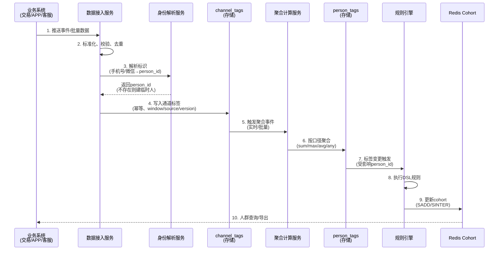
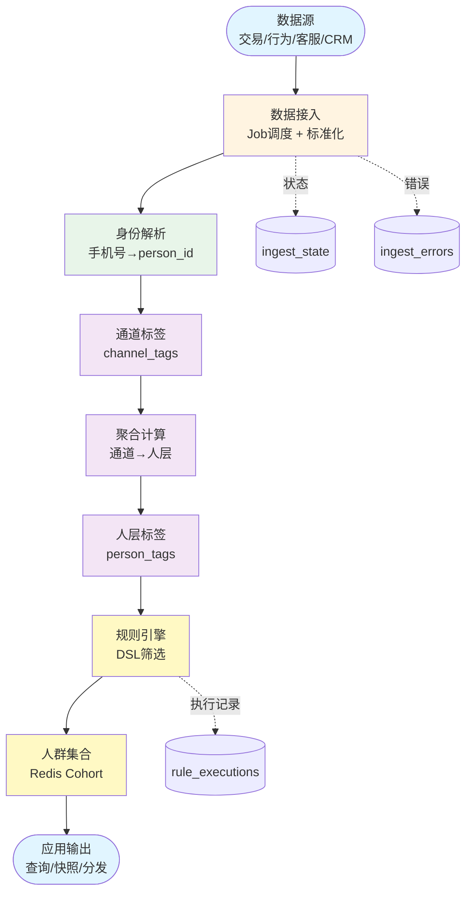

## 用户标签引擎技术方案（以身份证为主键）

### 一、目标与范围
- 构建可扩展的用户标签引擎，统一以身份证为主键的人（person）进行画像与筛选。
- 支持多数据源接入（交易、行为、社群、外呼等），并聚合多个手机号、多个微信号到同一人。
- 提供规则驱动的人群筛选、客群快照和线索分发能力，服务销售精细化运营。

### 0. 需求整合清单（共识）
- 数据接入：多数据源/多数据库连接，按“数据源-表/接口”粒度定义 Job；增量水位、批量与重试。
- 标识治理：支持弱标识（手机号等）建“临时人”，获取强标识（身份证/unionid/客户号）后合并；全链路幂等与审计。
- 标签体系：分通道层与人层；`tag_dict` 定义口径/类型/窗口/聚合/版本；标签写入包含 window/source/version。
- 聚合计算：通道→人层遵循 `aggregation`（sum/max/avg/any/best_of 等），支持实时触发与离线批处理。
- 规则与人群：DSL 配置、试算/执行、审计；Redis 维护 cohort/位图，支持快照与导出。
- 回灌与重算：规则或口径变更可对存量回评估；任务状态、错误与执行明细可观测、可重试。
- 安全合规：身份证只存哈希（加盐），最小化数据使用，接口鉴权与导出留痕。

### 二、总体架构
- 核心理念：人层（person）是唯一真相；通道层（channel）承载具体手机号/微信号等标识。
- 组件分层：
  - 数据接入层：标准化事件/明细，写入通道层标签。
  - 聚合计算层：将通道层指标按口径聚合到人层标签。
  - 规则/人群层：基于人层标签做筛选、快照、导出与分发。
  - 存储与缓存：MySQL（字典/事实/审计）+ Redis（cohort 人群集与位图）。

### 二点五、运行逻辑图（分层架构，数据流视角）
```mermaid
╔═════════════════════════════════════════════════════════════════════════╗
║                               数据源层                               ║
╚═════════════════════════════════════════════════════════════════════════╝
   ┌─────┐   ┌─────┐   ┌─────┐   ┌─────┐
   │交易系统│ │APP行为│ │客服系统│ │CRM │
   └─────┘   └─────┘   └─────┘   └─────┘
      │       │         │       │
      └───────┴─────────┘
           ▼
╔═════════════════════════════════════════════════════════════════════════╗
║                               接入层                                 ║
╚═════════════════════════════════════════════════════════════════════════╝
   ┌───────────────────────────────────────┐
   │  Job调度器   增量水位                │
   └───────────────────────────────────────┘
           ▼
   ┌───────────────────────────────────────┐
   │  标准化   校验                       │
   └───────────────────────────────────────┘
           ▼
╔═════════════════════════════════════════════════════════════════════════╗
║                               身份层                                 ║
╚═════════════════════════════════════════════════════════════════════════╝
   ┌───────────────────────────────────────┐
   │ IdentifierService                      │
   │ 手机号→person_id                       │
   └───────────────────────────────────────┘
           ▼
   ┌───────────────────────────────────────┐
   │ 临时人建表   强标识合并                │
   └───────────────────────────────────────┘
           ▼
╔═════════════════════════════════════════════════════════════════════════╗
║                               标签层                                 ║
╚═════════════════════════════════════════════════════════════════════════╝
   ┌───────────────────────────────────────┐
   │ channel_tags                           │
   │ 通道标签存储                           │
   └───────────────────────────────────────┘
           ▼
   ┌───────────────────────────────────────┐
   │ Aggregator                             │
   │ 聚合计算                               │
   └───────────────────────────────────────┘
           ▼
   ┌───────────────────────────────────────┐
   │ person_tags                            │
   │ 人层标签存储                           │
   └───────────────────────────────────────┘
           ▼
╔═════════════════════════════════════════════════════════════════════════╗
║                               规则层                                 ║
╚═════════════════════════════════════════════════════════════════════════╝
   ┌───────────────────────────────────────┐
   │ RuleEngine                              │
   │ DSL执行                                 │
   └───────────────────────────────────────┘
           ▼
   ┌───────────────────────────────────────┐
   │ Redis Cohort                            │
   │ 人群集合                               │
   └───────────────────────────────────────┘
           ▼
╔═════════════════════════════════════════════════════════════════════════╗
║                               应用层                                 ║
╚═════════════════════════════════════════════════════════════════════════╝
   ┌─────┐   ┌─────┐   ┌─────┐
   │人群查询│ │快照导出│ │分发推送│
   └─────┘   └─────┘   └─────┘

```

### 二点六、运行逻辑图（时序视角）


### 二点七、运行逻辑图（简化版，核心路径）


### 三、数据模型
```sql
-- 人：身份证（脱敏哈希）为主键
CREATE TABLE person (
  person_id       CHAR(32) PRIMARY KEY,     -- md5(uppercase(id_card_no_without_spaces))
  id_card_hash    CHAR(32) UNIQUE,
  name            VARCHAR(64) NULL,
  gender          TINYINT NULL,
  birthday        DATE NULL,
  created_at      DATETIME,
  updated_at      DATETIME
);

-- 标识绑定：一个人可有多个手机号/微信/外部ID
CREATE TABLE person_identifier (
  id              BIGINT PRIMARY KEY AUTO_INCREMENT,
  person_id       CHAR(32),
  id_type         ENUM('phone','wechat','external','email') NOT NULL,
  id_value        VARCHAR(128) NOT NULL,
  is_primary      TINYINT DEFAULT 0,
  verified        TINYINT DEFAULT 0,
  created_at      DATETIME,
  updated_at      DATETIME,
  UNIQUE KEY uk_type_value (id_type, id_value),
  KEY idx_person (person_id)
);

-- 标签字典
CREATE TABLE tag_dict (
  tag_code        VARCHAR(128) PRIMARY KEY, -- 例：person.trade.arpu_90d
  name            VARCHAR(128),
  category        VARCHAR(64),
  level           ENUM('person','channel') NOT NULL,
  type            ENUM('int','bool','enum','set','string','float') NOT NULL,
  enum_values     JSON NULL,
  unit            VARCHAR(16) NULL,
  aggregation     ENUM('sum','max','min','avg','any','best_of') NULL, -- 通道→人层口径
  description     TEXT,
  version         INT DEFAULT 1,
  status          ENUM('draft','active','deprecated') DEFAULT 'active',
  owner           VARCHAR(64),
  created_at      DATETIME,
  updated_at      DATETIME
);

-- 人层标签（销售筛选用）
CREATE TABLE person_tags (
  person_id       CHAR(32),
  tag_code        VARCHAR(128),
  tag_value       VARCHAR(256),
  confidence      TINYINT DEFAULT 100,
  source          VARCHAR(64),
  window          VARCHAR(32),
  version         INT,
  updated_at      DATETIME,
  PRIMARY KEY (person_id, tag_code),
  KEY idx_tag (tag_code, tag_value)
);

-- 通道层标签（手机号/微信号维度）
CREATE TABLE channel_tags (
  id              BIGINT PRIMARY KEY AUTO_INCREMENT,
  id_type         ENUM('phone','wechat','external') NOT NULL,
  id_value        VARCHAR(128) NOT NULL,
  tag_code        VARCHAR(128),
  tag_value       VARCHAR(256),
  source          VARCHAR(64),
  window          VARCHAR(32),
  updated_at      DATETIME,
  UNIQUE KEY uk_dim (id_type, id_value, tag_code),
  KEY idx_tag (tag_code, tag_value)
);

-- 规则配置与执行审计
CREATE TABLE tag_rules (
  rule_id         BIGINT PRIMARY KEY AUTO_INCREMENT,
  name            VARCHAR(128),
  dsl             JSON,
  status          ENUM('draft','active','paused') DEFAULT 'active',
  schedule        VARCHAR(64) NULL,
  output_tag      VARCHAR(128) NULL,
  owner           VARCHAR(64),
  created_at      DATETIME,
  updated_at      DATETIME
);

CREATE TABLE rule_executions (
  exec_id         BIGINT PRIMARY KEY AUTO_INCREMENT,
  rule_id         BIGINT,
  started_at      DATETIME,
  finished_at     DATETIME,
  affected_users  INT,
  status          ENUM('success','failed','partial'),
  message         TEXT
);
```

### 四、标签规范
- 分类：
  - 基础画像、行为活跃、交易能力、风险合规、社交关系、生命周期、设备画像、地域属性。
- 命名：`{level}.{category}.{name}_{window}`
  - 人层：`person.trade.arpu_90d`，`person.behavior.active_days_30d`
  - 通道层：`channel.wechat.group_join_30d`，`channel.phone.outbound_connect_7d`
- 口径：在 `tag_dict` 中声明 `type/enum/range/aggregation/window/update_freq/version`。
- 聚合：
  - 风险类：any（任一通道命中→人层命中）。
  - 活跃/价值：max/sum/avg 视业务定义。
  - 可达性：best_of（如选近30日响应率最高的手机号）。

### 五、规则与人群（DSL）
```json
{
  "name": "高潜付费人群",
  "logic": "AND",
  "conditions": [
    {"tag": "person.trade.arpu_90d", "op": "gte", "value": 500},
    {"tag": "person.behavior.active_days_30d", "op": "gte", "value": 10},
    {"tag": "person.risk.blacklist", "op": "eq", "value": false}
  ],
  "window": "rolling_90d",
  "ttl": "24h"
}
```

### 六、计算与刷新策略
- 批处理（T+1/T+0小时）：生成稳定画像（交易统计、生命周期等）。
- 准实时（秒级/分级）：事件驱动更新通道层标签，触发对应人层增量聚合。
- 回评估：字典/规则变更后对存量人群重算，并写入审计。

### 七、系统设计（ThinkPHP 5.1）
- 目录结构（`application/tag`）：
  - controller：`TagDictController`、`RuleController`、`SegmentController`、`IdentifierController`
  - model：`TagDict`、`Person`、`PersonIdentifier`、`PersonTags`、`ChannelTags`、`TagRules`、`RuleExecutions`
  - service：
    - `IdentifierService`（标识绑定/查找/合并）
    - `ChannelTagService`（通道标签写入）
    - `PersonTagService`（人层聚合/重算）
    - `TagQueryService`（条件解析→Redis/DB组合查询）
    - `RuleEngineService`（DSL 校验/执行/审计）
    - `CohortCacheService`（cohort 维护、集合/位图运算）
  - command：`ExecuteRule`、`RecomputeTags`、`CohortSnapshot`

- 路由（建议，受 `jwt` 保护）：
```php
Route::group('v1/tag', function () {
  Route::get('dict', 'app\\tag\\controller\\TagDictController@index');
  Route::post('dict', 'app\\tag\\controller\\TagDictController@create');
  Route::post('identifier/bind', 'app\\tag\\controller\\IdentifierController@bind');
  Route::post('rule/execute/:id', 'app\\tag\\controller\\RuleController@execute');
  Route::post('segment/query', 'app\\tag\\controller\\SegmentController@query');
  Route::post('segment/snapshot', 'app\\tag\\controller\\SegmentController@snapshot');
})->middleware(['jwt']);
```

### 八、查询与筛选
- 人层为主：`person_tags` 组合条件查询，Redis 保存常用 cohort：
  - Redis 示例：`SINTER cohort:person.trade.arpu_90d:gt500 cohort:person.active_days_30d:gte10 SDIFF cohort:person.risk.blacklist:eq1`
- MySQL 组合查询示例：
```sql
SELECT DISTINCT t1.person_id
FROM person_tags t1
JOIN person_tags t2 ON t2.person_id=t1.person_id
LEFT JOIN person_tags t3 ON t3.person_id=t1.person_id AND t3.tag_code='person.risk.blacklist'
WHERE t1.tag_code='person.trade.arpu_90d' AND CAST(t1.tag_value AS DECIMAL)>=500
  AND t2.tag_code='person.behavior.active_days_30d' AND CAST(t2.tag_value AS SIGNED)>=10
  AND (t3.tag_value IS NULL OR t3.tag_value='0')
LIMIT 50 OFFSET 0;
```

### 九、关键流程
1) 事件接入：收到 `id_type + id_value`（如手机号）→ 查 `person_identifier` → 得到 `person_id`。
2) 通道标签更新：写 `channel_tags`，并发布“聚合任务”。
3) 人层聚合：按 `tag_dict.aggregation` 规则，更新 `person_tags`。
4) 规则评估：对受影响的 `person_id` 运行启用中的规则，更新 cohort/输出标签。
5) 人群产出：支持分页查询、生成快照、导出或推送 CRM/外呼系统。

### 十、缓存与索引
- Redis：
  - 集合/位图存 cohort，Key 规范：`cohort:{tag_code}:{op}{value}` 或区间桶。
  - TTL：默认 24h，可按规则 `ttl` 覆盖。
- MySQL：
  - `person_tags(tag_code, tag_value)`、`channel_tags(tag_code, tag_value)` 倒排索引。
  - 审计表按时间分区或冷热分离。

### 十一、合规与安全
- 身份证只存哈希（不可逆），不落明文；导出脱敏。
- 最小权限访问，接口留痕审计（规则执行、导出、查看）。
- 口径透明：标签保留来源、窗口、置信度、版本。

### 十二、里程碑（落地计划）
- M1：建表与服务骨架；接入交易/行为两类数据；产出10个核心标签。
- M2：规则试算与快照；Redis cohort；首批销售客群模板（高价值流失预警）。
- M3：通道“最佳触达”策略；CRM/外呼对接；质量监控与看板。


