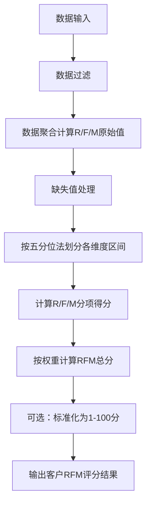

# RFM 客户价值评分体系技术实施文档

## 1. 文档目的

本文档旨在明确 RFM（Recency-Frequency-Monetary）客户价值评分体系的技术实现标准，包括维度定义、评分规则、数据处理流程、参数配置及异常处理方案，为系统开发、数据分析及业务应用提供统一依据。

## 2. 核心术语定义

| 术语     | 英文缩写         | 定义                              | 数据来源      | 统计周期说明                             |
| ------ | ------------ | ------------------------------- | --------- | ---------------------------------- |
| 最近消费时间 | Recency（R）   | 客户最后一次有效消费行为距统计截止日的时间间隔（单位：天）   | 订单系统、交易日志 | 支持自定义配置（默认 3-12 个月，按业务场景调整）        |
| 消费频率   | Frequency（F） | 统计周期内客户发生有效消费行为的总次数             | 订单系统、交易日志 | 与 R 维度统计周期一致，剔除重复下单、取消订单等无效记录      |
| 消费金额   | Monetary（M）  | 统计周期内客户有效消费行为的总金额（单位：元，支持多币种换算） | 订单系统、支付日志 | 仅统计已支付完成的订单金额，剔除退款、优惠抵扣部分          |
| RFM 总分 | RFM Score    | 基于 R、F、M 三个维度的分项得分，按预设权重计算的综合得分 | 系统计算生成    | 得分范围 1-15 分（5 分制单项）或 1-100 分（标准化后） |

## 3. 评分规则技术规范

### 3.1 分项评分规则（默认 5 分制）

#### 3.1.1 Recency（R）评分规则

* 核心逻辑：时间间隔越短，得分越高（反向映射）

* 分段标准：采用**五分位法**（按数据分布自动划分区间，避免均分失真）

| 得分  | 时间间隔区间（天）  | 划分逻辑              |
| --- | ---------- | ----------------- |
| 5 分 | \[0, T1]   | 统计周期内最近消费的 20% 客户 |
| 4 分 | (T1, T2]   | 统计周期内次近消费的 20% 客户 |
| 3 分 | (T2, T3]   | 统计周期内中间消费的 20% 客户 |
| 2 分 | (T3, T4]   | 统计周期内较久消费的 20% 客户 |
| 1 分 | (T4, Tmax] | 统计周期内最久消费的 20% 客户 |

* 区间计算方式：T1=PERCENTILE\_CONT (0.2)、T2=PERCENTILE\_CONT (0.4)、T3=PERCENTILE\_CONT (0.6)、T4=PERCENTILE\_CONT (0.8)，其中 Tmax 为统计周期总天数

#### 3.1.2 Frequency（F）评分规则

* 核心逻辑：消费次数越多，得分越高（正向映射）

* 分段标准：采用**五分位法**（支持最小消费次数阈值配置）

| 得分  | 消费次数区间      | 划分逻辑                |
| --- | ----------- | ------------------- |
| 5 分 | \[F4, +∞)   | 统计周期内消费次数最多的 20% 客户 |
| 4 分 | \[F3, F4)   | 统计周期内消费次数次多的 20% 客户 |
| 3 分 | \[F2, F3)   | 统计周期内消费次数中间的 20% 客户 |
| 2 分 | \[F1, F2)   | 统计周期内消费次数较少的 20% 客户 |
| 1 分 | \[Fmin, F1) | 统计周期内消费次数最少的 20% 客户 |

* 区间计算方式：F1=PERCENTILE\_CONT (0.2)、F2=PERCENTILE\_CONT (0.4)、F3=PERCENTILE\_CONT (0.6)、F4=PERCENTILE\_CONT (0.8)，其中 Fmin 为 1（仅统计有效消费次数≥1 的客户）

#### 3.1.3 Monetary（M）评分规则

* 核心逻辑：消费金额越高，得分越高（正向映射）

* 分段标准：采用**五分位法**（支持剔除大额异常值后划分）

| 得分  | 消费金额区间（元）   | 划分逻辑                |
| --- | ----------- | ------------------- |
| 5 分 | \[M4, +∞)   | 统计周期内消费金额最高的 20% 客户 |
| 4 分 | \[M3, M4)   | 统计周期内消费金额次高的 20% 客户 |
| 3 分 | \[M2, M3)   | 统计周期内消费金额中间的 20% 客户 |
| 2 分 | \[M1, M2)   | 统计周期内消费金额较低的 20% 客户 |
| 1 分 | \[Mmin, M1) | 统计周期内消费金额最低的 20% 客户 |

* 区间计算方式：M1=PERCENTILE\_CONT (0.2)、M2=PERCENTILE\_CONT (0.4)、M3=PERCENTILE\_CONT (0.6)、M4=PERCENTILE\_CONT (0.8)，其中 Mmin 为统计周期内最小有效订单金额

### 3.2 总分计算规则

#### 3.2.1 加权求和公式

$RFM_{Score} = R_{Score} \times W_R + F_{Score} \times W_F + M_{Score} \times W_M$

* 权重配置：支持自定义（默认配置：$W_R=0.4$，$W_F=0.3$，$W_M=0.3$）

* 权重约束：$W_R + W_F + W_M = 1.0$，且单个权重取值范围为 \[0.1, 0.8]

#### 3.2.2 得分标准化（可选）

* 若需将总分映射为 1-100 分，采用线性标准化公式：

  $RFM_{StandardScore} = \frac{RFM_{Score} - RFM_{Min}}{RFM_{Max} - RFM_{Min}} \times 99 + 1$

* 其中：$RFM_{Min}=W_R \times 1 + W_F \times 1 + W_M \times 1$，$RFM_{Max}=W_R \times 5 + W_F \times 5 + W_M \times 5$

## 4. 数据处理流程

### 4.1 数据输入要求

| 数据项    | 数据类型          | 格式要求                | 校验规则         |
| ------ | ------------- | ------------------- | ------------ |
| 客户唯一标识 | String/Int    | 全局唯一（如用户 ID、会员 ID）  | 非空、去重        |
| 订单唯一标识 | String/Int    | 全局唯一（如订单号）          | 非空、去重        |
| 消费时间   | DateTime      | yyyy-MM-dd HH:mm:ss | 需在统计周期内      |
| 消费金额   | Decimal(18,2) | 大于 0                | 剔除负数、0 值     |
| 订单状态   | String        | 枚举值（已支付、已取消、已退款等）   | 仅保留 “已支付” 状态 |

### 4.2 数据预处理步骤

1. **数据过滤**：

* 剔除统计周期外的订单数据

* 剔除订单状态为 “已取消”“已退款”“无效” 的记录

* 剔除员工内部订单、测试订单（按订单标签或用户标签过滤）

* 剔除单笔金额超过$M_{99分位值} \times 3$的异常大额订单（可配置开关）

1. **数据聚合**：

* 按客户唯一标识分组，计算 R、F、M 原始指标：

  * R：MAX (消费时间) 到统计截止日的时间间隔（天）

  * F：COUNT (DISTINCT 订单唯一标识)

  * M：SUM (消费金额)

1. **缺失值处理**：

* 统计周期内无消费记录的客户：R = 统计周期总天数，F=0，M=0，分项得分均为 1 分

* 单个指标缺失（如仅缺失 M）：按 1 分计分项得分

### 4.3 评分计算流程

## 5. 参数配置说明

| 参数名称    | 配置项                    | 取值范围          | 默认值    | 配置方式            |
| ------- | ---------------------- | ------------- | ------ | --------------- |
| 统计周期    | cycle\_days            | 30-365        | 180    | 系统配置页手动输入       |
| R 维度权重  | weight\_R              | 0.1-0.8       | 0.4    | 系统配置页滑动条调整      |
| F 维度权重  | weight\_F              | 0.1-0.8       | 0.3    | 系统配置页滑动条调整      |
| M 维度权重  | weight\_M              | 0.1-0.8       | 0.3    | 系统配置页滑动条调整      |
| 异常金额阈值  | abnormal\_money\_ratio | 1.5-5.0       | 3.0    | 系统配置页手动输入（倍数关系） |
| 评分分制    | score\_scale           | 5 分制 / 100 分制 | 5 分制   | 系统配置页单选         |
| 缺失值处理策略 | missing\_strategy      | 按 1 分计 / 剔除客户 | 按 1 分计 | 系统配置页单选         |

## 6. 异常处理方案

### 6.1 数据异常

| 异常类型   | 表现形式                           | 处理逻辑                   | 影响范围            |
| ------ | ------------------------------ | ---------------------- | --------------- |
| 重复订单   | 同一客户同一时间相同订单号                  | 去重保留 1 条有效记录           | 不影响 F、M 计算      |
| 大额异常订单 | 单笔金额 > $M_{99分位值} \times 异常阈值$ | 自动标记，可选择剔除或保留          | 仅影响 M 维度区间划分    |
| 消费时间异常 | 消费时间晚于统计截止日                    | 视为无效数据，剔除              | 不影响最终结果         |
| 客户标识重复 | 同一客户多个唯一标识                     | 按客户合并规则（如手机号、身份证号关联）聚合 | 需提前完成客户统一 ID 映射 |

### 6.2 计算异常

| 异常类型     | 触发条件                  | 处理逻辑                                    | 输出结果            |
| -------- | --------------------- | --------------------------------------- | --------------- |
| 维度区间为空   | 某维度所有客户数据相同（如 F 均为 1） | 强制均分 5 个区间                              | 分项得分按 1-5 分依次分配 |
| 权重总和不为 1 | 配置权重时计算错误             | 系统自动归一化处理（$W'_X = W_X / (W_R+W_F+W_M)$） | 不影响总分有效性        |
| 统计周期过短   | 小于 30 天导致数据量不足        | 系统给出警告，允许强制执行                           | 区间划分可能失真，建议延长周期 |

## 7. 输出结果格式

### 7.1 单客户评分结果

| 字段名       | 数据类型          | 示例                      |
| --------- | ------------- | ----------------------- |
| 客户 ID     | String        | CUST2023001             |
| R 原始值（天）  | Int           | 15                      |
| R 得分      | Int           | 5                       |
| F 原始值（次）  | Int           | 8                       |
| F 得分      | Int           | 4                       |
| M 原始值（元）  | Decimal(18,2) | 2560.00                 |
| M 得分      | Int           | 5                       |
| RFM 总分    | Decimal(5,2)  | 4.70                    |
| 标准化得分（可选） | Int           | 94                      |
| 统计周期      | String        | 2023-01-01 至 2023-06-30 |
| 计算时间      | DateTime      | 2023-07-01 00:30:25     |

### 7.2 批量输出文件格式

* 支持 CSV、Parquet、JSON 格式导出

* 编码格式：UTF-8

* 压缩方式：默认 GZIP（可配置关闭）

## 8. 业务适配建议

| 业务场景            | 统计周期建议  | 权重调整建议                      | 特殊配置              |
| --------------- | ------- | --------------------------- | ----------------- |
| 快消零售            | 3-6 个月  | $W_R=0.5, W_F=0.3, W_M=0.2$ | 提高 R 维度权重，关注复购及时性 |
| 高客单价行业（如奢侈品、家居） | 12 个月   | $W_R=0.3, W_F=0.2, W_M=0.5$ | 提高 M 维度权重，关注消费能力  |
| 新品推广期           | 1-3 个月  | $W_R=0.6, W_F=0.2, W_M=0.2$ | 重点关注近期新客户         |
| 会员体系运营          | 6-12 个月 | $W_R=0.4, W_F=0.4, W_M=0.2$ | 提高 F 维度权重，鼓励高频消费  |

> （注：文档部分内容可能由 AI 生成）