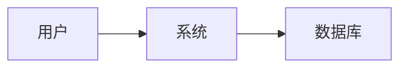

# Next AI Draw

> **归属**：木果（项目模板）  
> **能力来源**：[DayuanJiang/next-ai-draw-io](https://github.com/DayuanJiang/next-ai-draw-io)（20k+★）+ Mermaid + 开发模板@生成图表

---

## 一、能做什么

| 能力 | 说明 |
|:---|:---|
| **自然语言生成图** | 用文字描述 → AI 生成 draw.io 风格架构图、流程图 |
| **图片/文档转图** | 上传现有图或 PDF/文本 → AI 复刻或优化为专业图表 |
| **Mermaid 图表** | 流程、时序、ER 图等，适合嵌入 Markdown/文档 |
| **PPT 配图** | 与 PPT 制作 Skill 联动，为幻灯片生成逻辑性图表 |
| **数据图表** | 增长曲线、统计图等（配合 Recharts/matplotlib 思路） |

---

## 二、外部项目（基因胶囊吸收）

### 2.1 next-ai-draw-io

| 项 | 内容 |
|:---|:---|
| **GitHub** | https://github.com/DayuanJiang/next-ai-draw-io |
| **在线演示** | https://next-ai-drawio.jiang.jp/ 或 https://next-ai-draw-io.vercel.app/ |
| **技术栈** | Next.js + draw.io + LLM（OpenAI/Gemini/Claude） |
| **核心功能** | 自然语言→图、图片复刻、文档转图、AI 推理过程可见 |
| **部署** | Docker、Vercel、Cloudflare Workers |
| **许可证** | Apache 2.0 |

### 2.2 吸收格式（基因胶囊）

```json
{
  "source": "github:DayuanJiang/next-ai-draw-io",
  "absorbed_at": "2026-02-23",
  "manifest": {
    "name": "next-ai-draw-io",
    "description": "AI-Powered Diagram Generator with draw.io",
    "capabilities": ["natural_language_to_diagram", "image_replication", "document_to_diagram"],
    "integrated_into": "03_卡木（木）/木果_项目模板/Next AI Draw/SKILL.md"
  }
}
```

---

## 三、执行流程

### 3.1 自然语言生成图

1. **收集需求**：主题、图类型（架构/流程/时序/ER）、关键节点
2. **写提示词**：如「画出卡若AI 五行团队架构：金水木火土，各 2～3 成员」
3. **生成方式**：
   - **方式 A**：使用 next-ai-draw-io 在线/自部署 → 输入提示 → 导出 PNG/SVG
   - **方式 B**：用 Mermaid 语法生成 → 渲染为 PNG（mermaid-cli 或在线）
   - **方式 C**：用 Cursor GenerateImage 等生成示意图（架构/流程图风格）
4. **输出**：存 `卡若Ai的文件夹/图片/` 并登记 `图片索引.md`

### 3.2 画图表（Mermaid）

开发模板内 `@生成图表` 指令：生成 Mermaid 代码，如：



- 输出 Mermaid 源码，可粘贴到支持 Mermaid 的工具渲染
- 或使用 mermaid-cli：`mmdc -i input.mmd -o output.png`

### 3.3 与 PPT 制作联动

- PPT 需要「数据/成果」页：用 Next AI Draw 生成增长曲线、架构图
- 流程图页：用 Mermaid 或 next-ai-draw-io 生成后插入
- 参考：`PPT制作/参考资料/PPT制作完整逻辑框架.md` 中的「数据/成果 → chart」

---

## 四、使用方式

| 触发词 | 动作 |
|:---|:---|
| next ai draw、AI画图 | 按自然语言生成 draw.io 风格图 |
| 画图表、生成图表 | 生成 Mermaid 或数据图表 |
| 架构图、流程图 | 明确图类型后生成 |
| 与 PPT 联动 | 调用 PPT 制作时，用本 Skill 生成配图 |

---

## 五、相关文件

| 文件 | 说明 |
|:---|:---|
| `参考资料/next-ai-draw-io_基因胶囊吸收.md` | 外部项目吸收详情 |
| `03_卡木（木）/木果_项目模板/开发模板/SKILL.md` | @生成图表（Mermaid） |
| `03_卡木（木）/木果_项目模板/PPT制作/SKILL.md` | PPT 配图联动 |
| 输出目录 | `卡若Ai的文件夹/图片/` |

---

## 六、依赖与部署（自建时）

- Node.js 18+
- next-ai-draw-io：`git clone` 后 `npm install`，配置 LLM API Key
- Mermaid：`npm install -g @mermaid-js/mermaid-cli`（可选）
