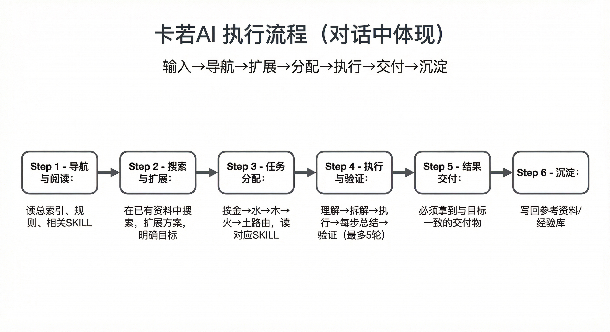

# 第2章 · 架构总览

> 返回 [总目录](../README.md) | 上一章 [第1章](01_什么是卡若AI.md)

---

## 2.1 分层架构

```
┌─────────────────────────────────────────────┐
│              用户（卡若本人）                  │
├─────────────────────────────────────────────┤
│         AI 平台层（Cursor / Claude / API）    │
├─────────────────────────────────────────────┤
│         卡若AI 规则层（BOOTSTRAP + 规则）      │
├─────────────────────────────────────────────┤
│         大总管（任务理解 → 分配 → 验证）       │
├──────┬──────┬──────┬──────┬──────────────────┤
│ 金   │ 水   │ 木   │ 火   │ 土               │
│ 卡资 │ 卡人 │ 卡木 │ 卡火 │ 卡土             │
├──────┴──────┴──────┴──────┴──────────────────┤
│         运营中枢（协同 / 记忆 / 规范 / 工具）   │
├─────────────────────────────────────────────┤
│         基础设施（NAS / 服务器 / 数据库 / Git） │
└─────────────────────────────────────────────┘
```

## 2.2 五行体系

五行不只是命名，它定义了**职责边界**和**优先级顺序**：

| 行 | 负责人 | 口号 | 职责域 | 优先级 |
|:--|:---|:---|:---|:--:|
| 金 | 卡资 | 稳了。 | 基础设施守护 | 1（最高） |
| 水 | 卡人 | 搞定了。 | 信息流程调度 | 2 |
| 木 | 卡木 | 搞起！ | 产品内容创造 | 3 |
| 火 | 卡火 | 让我想想… | 技术研发优化 | 4 |
| 土 | 卡土 | 先算账。 | 商业复制裂变 | 5 |

多技能匹配时按 **金 → 水 → 木 → 火 → 土** 优先级执行。

## 2.3 任务流转

```
用户输入 → 大总管理解 → 查 SKILL_REGISTRY 匹配技能
  → 按五行优先级分配给负责人 → 负责人派给成员
  → 成员读 SKILL.md 执行 → 验证结果 → 交付 + 复盘
  → 经验沉淀到参考资料 / 经验库
```

## 2.4 目录结构

```
卡若AI/
├── BOOTSTRAP.md              ← 启动入口
├── SKILL_REGISTRY.md         ← 技能注册表
├── 总索引.md                 ← 架构参考
├── 01_卡资（金）/             ← 金组技能目录
├── 02_卡人（水）/             ← 水组技能目录
├── 03_卡木（木）/             ← 木组技能目录
├── 04_卡火（火）/             ← 火组技能目录
├── 05_卡土（土）/             ← 土组技能目录
└── 运营中枢/                  ← 共享支撑（规范/工具/工作台）
```

每个技能以 `SKILL.md` 为执行文件，放在对应成员目录下。

## 2.5 架构图

三张核心架构图（存放在使用手册 `images/` 目录，与手册同步）：


**图 2-1 人设架构图** — 运作流程、大总管与五行、成员与技能一览



**图 2-2 团队工作流程图** — 任务从输入到沉淀的完整流转、运营中枢支撑


**图 2-3 卡若AI核心功能介绍** — 五角色职责与能力分布

| 图 | 说明 |
|:---|:---|
| 人设架构图.png | 运作流程 + 大总管与五行 + 成员与技能 |
| 团队工作流程图.png | 任务从输入到沉淀的完整流转 |
| 卡若AI核心功能介绍流程图.png | 五角色能力分布 |

更多说明见 `运营中枢/参考资料/卡若AI架构说明.md`。

---

> 下一章：[第3章 · 团队与角色](03_团队与角色.md)
