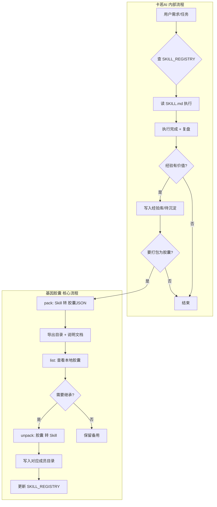

# 第16章 · 基因胶囊

> 返回 [总目录](../README.md) | 上一章 [第15章](15_记忆系统.md)

---

## 16.1 一句话理解（普通用户）

**基因胶囊** = 把 AI 学会的「本事」打成一个小包，可以存起来、传给别人、或者以后直接拿来用。就像「技能卡」：学会一次，到处复用。

## 16.2 概念与四部分组成

基因胶囊是卡若AI 的**技能遗传机制**：将验证过的 Skill 打包成可传递、可继承的能力单元。

**公式**：基因胶囊 = **策略（SKILL）** + **环境指纹** + **审计记录** + **资产 ID**


**图 16-1 基因胶囊概念与流程** — 四部分组成与继承校验

| 部分 | 说明 |
|:---|:---|
| **策略** | SKILL.md 完整内容（触发词、步骤、脚本路径） |
| **环境指纹** | Python 版本、平台、依赖（继承时校验兼容性） |
| **审计记录** | 最近复盘的「目标·结果·达成率」或执行摘要 |
| **资产 ID** | SHA-256 哈希，内容变则 ID 变，用于去重与溯源 |

## 16.3 三个操作（程序员）

| 操作 | 命令 | 说明 |
|:---|:---|:---|
| **pack** | `gene_capsule.py pack <skill_path>` | Skill → 胶囊 JSON（导出到本地目录） |
| **unpack** | `gene_capsule.py unpack <capsule_path>` | 胶囊 JSON → Skill（继承到指定目录） |
| **list** | `gene_capsule.py list` | 查看本地所有胶囊（名称、ID、创建时间） |
| **pack-all** | `gene_capsule.py pack-all` | 全量打包所有 Skill |

## 16.4 完整工作流（含技能工厂联动）


**图 16-2 基因胶囊完整工作流** — 内部流程 + 技能工厂联动 + 未来对外流通

- **卡若AI 内部**：用户需求 → 查 SKILL → 执行 → 复盘；经验有价值 → 经验库 → 可打包为胶囊
- **技能工厂联动**：创建 Skill 前先 list 查胶囊，有匹配则 unpack 继承；创建 Skill 后可 pack 打包
- **未来流通**：可选上传 EvoMap Market，全球 Agent 继承

### 流程图（Mermaid）



## 16.5 胶囊结构（YAML）

```yaml
version: "1.0"
capsule_id: "sha256:..."
manifest:
  name: 技能名称
  description: 一句话说明
  triggers: [触发词列表]
  owner: 归属成员
  group: 归属负责人
  skill_path: 原始 SKILL 路径
skill_content: |
  (SKILL.md 原文)
created_at: "2026-03-12T10:00:00"
updated_at: "2026-03-12T10:00:00"
```

**资产 ID 计算**：`capsule_id = "sha256:" + SHA256(skill_path + skill_content 前 8192 字符)`

## 16.6 存储与导出位置

| 位置 | 说明 |
|:---|:---|
| `卡若Ai的文件夹/导出/基因胶囊/` | 本地导出目录，每技能独立子目录 |
| `05_卡土（土）/土砖_技能复制/基因胶囊/capsule_index.json` | 胶囊索引 |

## 16.7 怎么用（普通用户）

说「打包技能」「解包胶囊」「基因胶囊」「继承能力」等触发词，卡若AI 会按对应 Skill 执行。也可让 AI「把这个技能打成胶囊」或「继承某某胶囊」。

## 16.8 使用场景

- 迁移到新 AI 环境时：打包→传输→解包
- 给其他项目复制能力：pack → 拷贝 → unpack
- 能力审计：查看每个胶囊的来源与版本
- 技能工厂创建新 Skill 前：先 list 查是否有可继承胶囊

---

> 下一章：[第17章 · 协同与 Pipeline](17_协同与Pipeline.md)
