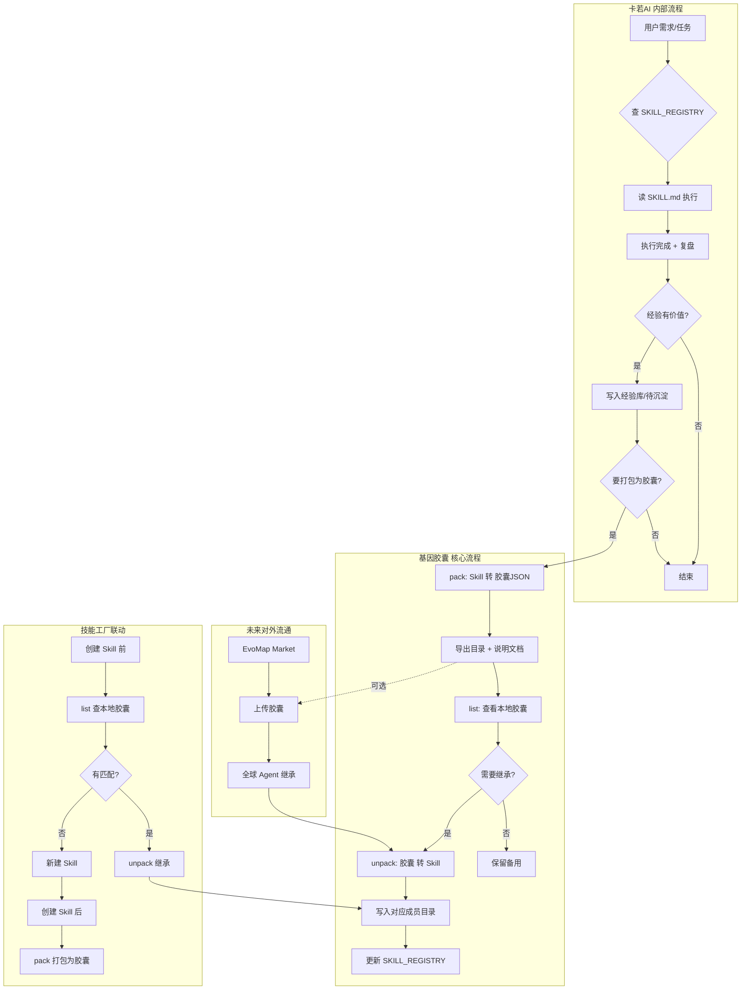

# 基因胶囊 · 功能流程图

> **版本**：1.0 | 更新：2026-02-22  
> **导出时同步**：每次 pack 会在 `导出/基因胶囊/README_基因胶囊导出说明.md` 中生成含流程图的说明文档

---

## 流程图（Mermaid）

以下为基因胶囊在卡若AI 中的完整功能流程，包含内部流程、核心操作、技能工厂联动及未来对外流通。

---

## 流程说明

| 区块 | 说明 |
|:---|:---|
| **卡若AI 内部流程** | 用户任务 → 查技能 → 执行 → 复盘 → 经验沉淀 → 可选打包为胶囊 |
| **基因胶囊 核心流程** | pack/unpack/list，导出时自动生成说明文档（含本流程图） |
| **技能工厂联动** | 创建前先查胶囊继承，创建后可打包为胶囊 |
| **未来对外流通** | 与 EvoMap Market 对接，实现跨 Agent 能力遗传 |

---

## 引用

- 规范：`运营中枢/参考资料/基因胶囊规范.md`
- 技能：`05_卡土（土）/土砖_技能复制/基因胶囊/SKILL.md`
- 导出说明：`卡若Ai的文件夹/导出/基因胶囊/README_基因胶囊导出说明.md`
